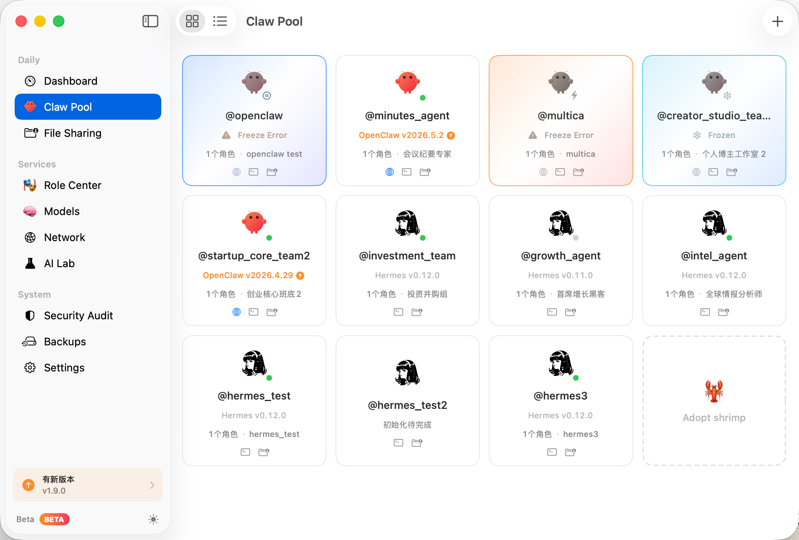
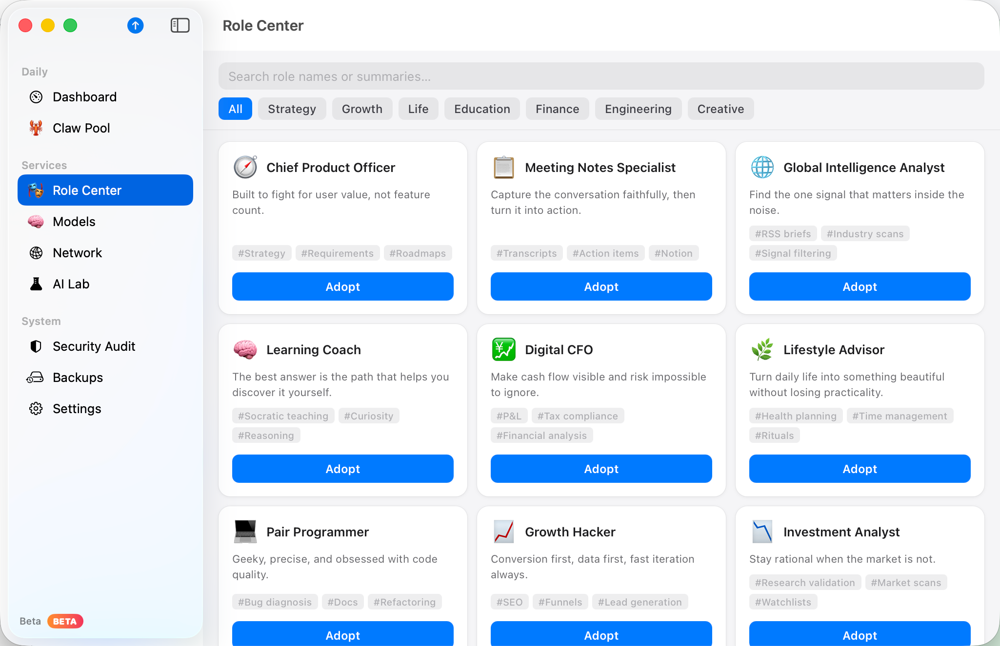
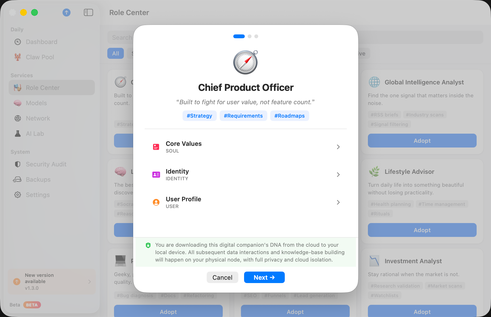

# ClawdHome

[](https://clawdhome.app)
[](https://developer.apple.com/swift/)
[](LICENSE)
[](https://github.com/ThinkInAIXYZ/clawdhome/releases)

English | [中文](README.zh.md)

> Multi-Agent security console for macOS — run an entire AI Agent team safely on a single Mac.

ClawdHome lets you run multiple independent AI Agent instances on one Mac — supporting both OpenClaw and Hermes Agent engines — with each instance isolated in its own macOS user account, runtime, data directory, and permission boundary. A single SwiftUI control panel backed by a privileged XPC helper daemon covers initialization, monitoring, backup, model configuration, and IM channel onboarding, with no shell scripting required.

Website: [clawdhome.app](https://clawdhome.app)  
Downloads: [GitHub Releases](https://github.com/ThinkInAIXYZ/clawdhome/releases)  
Changelog: [English](CHANGELOG.en.md) | [中文](CHANGELOG.zh.md)

## Community Groups

<table>
  <tr>
    <td align="center">
      
      <br />
      Feishu Group
    </td>
    <td align="center">
      
      <br />
      WeChat Group
    </td>
  </tr>
</table>

## Screenshots

<table>
  <tr>
    <td></td>
    <td></td>
  </tr>
  <tr>
      <td></td>
      <td></td>
  </tr>
</table>

## Why ClawdHome

Most multi-Agent setups are either too weak (Chrome profiles share a single macOS user account — credentials and cookies are readable across profiles) or too heavy (VMs and Docker cannot run macOS-native desktop apps). ClawdHome fills the gap: **strong isolation with low operational overhead**.

- **Real isolation, enforced by the OS kernel**: each Shrimp is a separate macOS user account. Processes, files, Keychain entries, and network policies are separated at the kernel level. If one Agent is compromised, its blast radius stops at its own UID boundary.
- **Safer privilege model**: the UI never executes privileged operations directly. All system-level actions go through an explicit XPC helper (LaunchDaemon) with a typed, auditable call surface.
- **Dual-engine coexistence**: run OpenClaw and Hermes Agent side-by-side on the same Mac, each independently configured, sharing a common API key store and backup system.
- **Unified operations**: initialization wizard, gateway lifecycle, file management, diagnostics, config hot-reload, backup/restore, and Cron tasks all live in one panel — no custom scripts, no manual launchd wiring.
- **Local-first, compliance-friendly**: all core features work offline. Data never leaves the machine unless you opt in to cloud services, which suits regulated industries with data residency requirements.

## Highlights

- **Dual-engine multi-Agent**: manage OpenClaw + Hermes Agents from a single panel. Each Shrimp supports multiple Agents, each with its own identity, model config, and IM binding.
- **Role Market and Skills Store**: summon a preconfigured Agent team from the Role Market with one click; extend capabilities via the Skills Store without starting from scratch.
- **13+ IM channels out of the box**: WeChat, Feishu, Telegram, Slack, WeCom, DingTalk, WhatsApp, email, and more — pair by QR scan or token form, unified channel directory maintained in one place.
- **All-in-one operations panel**: health monitoring, watchdog auto-recovery, maintenance terminal, and an integrated diagnostics center covering environment, permissions, config, security, gateway, and network.
- **Layered backup and restore**: per-Shrimp or global backups, restorable to any point in time.
- **Centralized model and provider management**: API keys stored in an isolated Keychain, apply a model profile to multiple Agents in one action, supports custom providers and local model services.
- **English and Chinese localization**: built on `Stable.xcstrings`, language follows the system setting.

## Who It's For

**AI studios and independent builders**: run Agents for multiple clients on one Mac, each client's credentials and data physically separated. Watchdog keeps things running around the clock; backups give you a paper trail when clients ask for evidence.

**Enterprise IT and compliance teams**: fully on-premise deployment, no data leaves the machine by default. Gateway logs and config changes are traceable, fitting financial, medical, and legal scenarios with data sovereignty and audit requirements.

**Developers and technical creators**: clone an existing Shrimp as an experiment sandbox, test freely, delete when done — the main environment stays clean. Use a dedicated demo Shrimp for livestreams so your real API keys never appear on screen.

## Architecture

```text
ClawdHome.app (SwiftUI admin UI)
  -> XPC -> ClawdHomeHelper (privileged LaunchDaemon)
      -> per-user OpenClaw / Hermes Agent instances
```

- `ClawdHome.app` is the operator-facing control plane for status, setup, and day-to-day maintenance.
- `ClawdHomeHelper` is the privileged boundary for user management, process control, file operations, installs, and system automation.
- Each Shrimp runs as a separate macOS user with its own Agent runtime and data directory.

## Security Model

- Privileged operations stay inside the helper boundary; the UI layer executes no system commands directly.
- Sensitive actions use explicit XPC methods rather than arbitrary shell paths.
- Ownership and permission repair are built into important lifecycle workflows.
- Runtime resources are separated per Shrimp to contain the blast radius of any single instance.

## Quick Start

### Requirements

- macOS 14+
- Xcode 15+
- Optional: [XcodeGen](https://github.com/yonaskolb/XcodeGen)

### Build From Source

```bash
open ClawdHome.xcodeproj
```

If you prefer to regenerate the Xcode project first:

```bash
xcodegen generate
open ClawdHome.xcodeproj
```

### Install Helper For Local Development

```bash
make install-helper
```

Equivalent direct command:

```bash
sudo bash scripts/install-helper-dev.sh install
```

## Common Commands

| Purpose | Command |
| --- | --- |
| Build app (Debug) | `make build` |
| Build helper only | `make build-helper` |
| Build release archive | `make build-release` |
| Build unsigned local package | `make pkg` |
| Build signed package for local validation | `make pkg-signed` |
| Build signed and notarized package | `make notarize-pkg` |
| Run full release flow | `make release NOTARIZE=true` |
| Run exported Release app directly | `make run-release` |
| Install latest generated package | `make install-pkg` |
| Uninstall development helper | `make uninstall-helper` |
| Tail helper logs | `make log-helper` |
| Tail app logs | `make log-app` |
| Run localization checks | `make i18n-check` |
| Clean build artifacts | `make clean` |

## Troubleshooting

### `npm install -g` fails on macOS

Check whether Xcode Command Line Tools are available:

```bash
xcode-select -p
```

If the command fails, install them:

```bash
xcode-select --install
```

If you hit an Xcode license error, accept it as an admin user:

```bash
sudo xcodebuild -license
# or non-interactive:
sudo xcodebuild -license accept
```

### Where to look for logs

- Helper log: `/tmp/clawdhome-helper.log`
- App log stream: `make log-app`

## Repository Layout

```text
ClawdHome/          SwiftUI app, views, models, services
ClawdHomeHelper/    privileged helper daemon and operations
Shared/             protocols and shared models for app/helper
Resources/          launch daemon plist and packaging resources
scripts/            build, install, packaging, release, and i18n utilities
docs/               project documentation and README assets
release-notes/      generated release-note drafts
```

## Localization

- Languages: English and Chinese
- String system: `Stable.xcstrings`
- Checks: `make i18n-check`
- Guide: [docs/i18n.md](docs/i18n.md)

## Roadmap

- [ ] External key management with an exec-based secrets provider
- [ ] Finer-grained network access control management
- [ ] Simpler setup for more model providers and IM channels
- [ ] Better local small-model workflows and Agent integration
- [ ] Stronger rescue and diagnostics capabilities
- [ ] Better gateway probing and historical health tracking
- [ ] More production-ready signed and notarized distribution workflows

## Contributing

- Open an issue before large or structural changes.
- Keep pull requests small, focused, and easy to review.
- Include validation evidence for behavior changes.
- Avoid committing local or private environment artifacts.
- Follow the existing Swift and project structure conventions.
- The repository currently does not ship automated unit tests, so manual verification notes are especially important in PRs.

## Star History

<a href="https://www.star-history.com/?repos=ThinkInAIXYZ%2Fclawdhome&type=date&legend=top-left">
 <picture>
   <source media="(prefers-color-scheme: dark)" srcset="https://api.star-history.com/image?repos=ThinkInAIXYZ/clawdhome&type=date&theme=dark&legend=top-left" />
   <source media="(prefers-color-scheme: light)" srcset="https://api.star-history.com/image?repos=ThinkInAIXYZ/clawdhome&type=date&legend=top-left" />
   
 </picture>
</a>

## License

Apache License 2.0. See [LICENSE](LICENSE).
