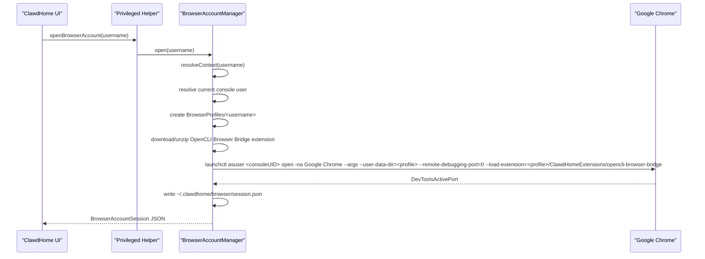
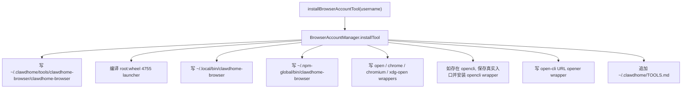
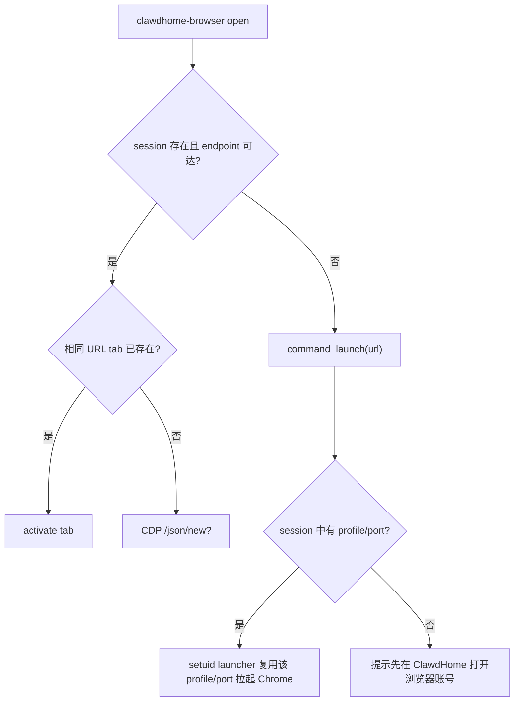

# ClawdHome Browser Account 技术规格

## 1. 背景与目标

ClawdHome 需要为每个受管 macOS 用户提供一套独立、可复用的网页登录环境，用来承载 OpenClaw、Hermes、OpenCLI Browser Bridge、OAuth 登录和后续网页自动化能力。

Browser Account 的核心目标：

- 每个受管用户拥有独立 Chrome profile，cookie/session 不互通。
- 不污染当前管理员或用户自己的主 Chrome/Arc/Safari。
- 不要求受管用户登录 macOS GUI 桌面。
- OpenClaw、Hermes 和未来 runtime 共用同一套用户级浏览器能力。
- 命令行中的常见浏览器打开动作自动进入 `clawdhome-browser open <url>`。
- OAuth 授权链接和 Browser Bridge 启动前置都走该用户的 ClawdHome Chrome。

重要边界：Chrome GUI 进程实际由当前 macOS console 用户启动，因为 macOS 图形应用必须挂在当前桌面会话上；受管用户只拥有命令入口、session 文件、工具文件和状态文件。隔离依赖独立 `--user-data-dir`，不是“Chrome 进程以受管用户身份运行”。

## 2. 设计原则

- 用户级，不绑定虾/OpenClaw/Hermes 路径：新路径统一放在 `~/.clawdhome`、`~/.local/bin` 和 `~/.npm-global/bin`。
- Runtime 消费，不拥有能力：OpenClaw 和 Hermes 只是调用 browser account，不分别实现浏览器。
- GUI 启动集中化：所有需要打开浏览器的路径最终落到 `BrowserAccountManager` 或 `clawdhome-browser`。
- CDP 只本机可见：Chrome 使用 `--remote-debugging-address=127.0.0.1`。
- 私有状态文件：session 文件为目标用户所有，权限 `0600`。
- 兼容旧路径：`.openclaw` 仅用于旧 session/profile 读取和 reset 清理，不再作为新安装路径。

## 3. 关键路径与权限

| 路径 | 归属 | 权限 | 用途 |
| --- | --- | --- | --- |
| `/Users/<console>/Library/Application Support/ClawdHome/BrowserProfiles/<username>/` | 当前 console 用户 | Chrome 默认 | ClawdHome UI/launcher 启动的 Chrome profile |
| `/Users/<console>/Library/Application Support/ClawdHome/BrowserProfiles/<username>/ClawdHomeExtensions/opencli-browser-bridge/` | 当前 console 用户 | `0755` | OpenCLI Browser Bridge unpacked Chrome extension |
| `/Users/<username>/.clawdhome/browser/` | 目标用户 | `0755` | browser session、debug、warmup 状态目录 |
| `/Users/<username>/.clawdhome/browser/session.json` | 目标用户 | `0600` | 当前 CDP endpoint、profile、端口、console 用户 |
| `/Users/<username>/.clawdhome/browser/install-warmup.json` | 目标用户 | `0600` | 初始化预热完成标记 |
| `/Users/<username>/.clawdhome/browser/debug.log` | 目标用户 | 用户可写 | wrapper / launcher / Python CLI 调试日志 |
| `/Users/<username>/.clawdhome/browser/profile/` | 目标用户 | Chrome 默认 | 无 ClawdHome session 时用户命令兼容 profile |
| `/Users/<username>/.clawdhome/tools/clawdhome-browser/clawdhome-browser` | 目标用户 | `0755` | Python CLI 主体 |
| `/Users/<username>/.local/bin/clawdhome-browser` | 目标用户 | `0755` | runtime 无关入口，Hermes 优先走这里 |
| `/Users/<username>/.npm-global/bin/clawdhome-browser` | 目标用户 | `0755` | OpenClaw/npm 环境入口 |
| `/Users/<username>/.local/bin/open` 等 | 目标用户 | `0755` | 常见浏览器命令 wrapper |
| `/Users/<username>/.npm-global/bin/open` 等 | 目标用户 | `0755` | OpenClaw 维护命令中的浏览器命令 wrapper |
| `/Users/<username>/.local/bin/open-cli` | 目标用户 | `0755` | npm `open-cli` URL opener wrapper |
| `/Users/<username>/.npm-global/bin/open-cli` | 目标用户 | `0755` | npm 全局环境中的 `open-cli` wrapper |
| `/Library/Application Support/ClawdHome/BrowserLaunchers/<username>/clawdhome-browser-launcher` | `root:wheel` | `4755` | 从目标用户命令借助 console GUI session 拉起 Chrome |
| `/Users/<username>/.clawdhome/TOOLS.md` | 目标用户 | 用户可读 | 工具说明，给 agent/runtime 使用 |

## 4. 组件地图

| 层 | 文件 | 职责 |
| --- | --- | --- |
| UI - OpenClaw 用户详情 | `ClawdHome/Views/UserDetailView.swift` | 概览页浏览器账号卡片：打开、安装工具、刷新、重置 |
| UI - Hermes 详情 | `ClawdHome/Views/HermesDetailView.swift` | 左侧“浏览器”入口和 Hermes 浏览器配置页 |
| 维护窗口 | `ClawdHome/ClawdHomeApp.swift` | 授权链接按钮通过用户浏览器账号打开 |
| 终端链接处理 | `ClawdHome/Views/TerminalLogView.swift`、`HermesDetailView.swift` | 用户点击 http(s) 链接时调用 `openBrowserAccountURL` |
| XPC 协议 | `Shared/HelperProtocol.swift` | Browser Account 方法声明 |
| XPC 客户端 | `ClawdHome/Services/HelperClient.swift` | App 侧 async 封装 |
| XPC Helper surface | `ClawdHomeHelper/HelperImpl+BrowserAccount.swift` | XPC 到 manager 的薄转发 |
| Manager | `ClawdHomeHelper/Operations/BrowserAccountManager.swift` | Chrome 启动、session 写入、工具安装、wrapper 生成、reset |
| Runtime env - OpenClaw | `ClawdHomeHelper/Operations/UserEnvContract.swift` | OpenClaw PATH 中优先放入 browser wrapper |
| Runtime env - Hermes | `ClawdHomeHelper/Operations/HermesInstaller.swift`、`HermesGatewayManager.swift` | 注入 `BROWSER=clawdhome-browser open %s` |
| Models | `Shared/BrowserAccountModels.swift` | 路径常量、session/status、DevToolsActivePort 解析 |

## 5. 数据模型

`BrowserAccountSession` 写入 `~/.clawdhome/browser/session.json`，主要字段：

- `username`：目标受管用户。
- `profilePath`：实际 Chrome profile 路径。
- `devToolsActivePortPath`：Chrome 写出的 `DevToolsActivePort` 文件。
- `httpEndpoint`：本机 CDP HTTP endpoint，例如 `http://127.0.0.1:35750`。
- `webSocketDebuggerURL`：CDP WebSocket URL。
- `cdpPort`：CDP 端口。
- `launchedAt`：启动时间。
- `consoleUsername`：实际承载 GUI Chrome 的 console 用户。

`BrowserAccountStatus` 用于 UI 展示：

- `toolInstalled`
- `sessionExists`
- `browserReachable`
- `httpEndpoint`
- `profilePath`
- `toolPath`
- `message`

## 6. UI 打开浏览器账号

说明：

- `username` 是受管 macOS 用户，不是 runtime 类型。
- Chrome GUI 进程属于 console 用户；登录态隔离依赖独立 profile。
- OpenCLI Browser Bridge 扩展随 profile 安装并通过 `--load-extension` 加载，不要求用户手动进入 `chrome://extensions`。
- 找不到系统 Google Chrome 时返回安装提示，不自动下载 Chrome。
- session 文件写入前会确保 `~/.clawdhome/browser` 归目标用户所有，避免 root 创建目录后目标用户无法写日志。

## 7. 工具安装流程

安装位置分两类：

- `~/.local/bin`：runtime 无关入口，Hermes、Python、shell 工具优先使用。
- `~/.npm-global/bin`：OpenClaw/npm 生态入口，覆盖 OpenCLI 这类 npm 全局命令。

wrapper 写日志时使用 `|| true`，日志目录权限异常不会导致 `open`、`opencli` 或 `open-cli` 命令直接失败。

## 7.1 OpenCLI Browser Bridge 扩展安装

官方手动流程是下载 OpenCLI release 中的 extension zip，然后在 `chrome://extensions` 中开启 Developer Mode 并 Load unpacked。ClawdHome 在浏览器初始化时自动完成等价流程：

1. 请求 `https://api.github.com/repos/jackwener/opencli/releases/latest`。
2. 选择 release assets 中名称包含 `extension` 且后缀为 `.zip` 的包，例如 `opencli-extension-v1.0.4.zip`。
3. 下载并解压到当前 Chrome profile：
   `<profile>/ClawdHomeExtensions/opencli-browser-bridge/`。
4. 验证解压结果必须包含 `manifest.json`，并拒绝 zip 中的绝对路径或 `..` 路径。
5. 按用户名计算该用户独立的 OpenCLI daemon 端口，并把扩展 `dist/background.js` 中的 `DAEMON_PORT` 改写为该端口。
6. 启动 Chrome 后通过 CDP `Extensions.loadUnpacked` 加载该扩展。

扩展目录放在 profile 下，而不是目标用户 home 下。原因是 macOS GUI Chrome 进程实际由 console 用户承载，profile 及 unpacked extension 必须对该 GUI 进程可读。

所有 ClawdHome 管理的 Chrome 启动路径都应通过 `clawdhome-browser-pipe-launcher` 加载 OpenCLI Browser Bridge。`clawdhome-browser` 以目标用户身份运行，通常不能读取 console 用户 `Library/Application Support` 下的 profile，因此它只负责请求启动；扩展下载、端口改写、解压和 `manifest.json` 校验由 root helper / setuid launcher 侧完成。缺插件时 launcher 会失败并提示用户回到 ClawdHome 重新安装/初始化浏览器工具，不会裸启动没有 Browser Bridge 的 Chrome。

## 8. `clawdhome-browser` 命令

支持命令：

- `status`：读取 session 并探测 CDP 是否可达。
- `launch [url]`：底层启动 Chrome。正常用户不需要直接使用。
- `open <url>`：启动/复用浏览器并打开 URL。
- `title`：读取当前页面标题。
- `extract-text`：提取当前页面正文。
- `screenshot`：保存当前页面截图。

`open <url>` 行为：

注意：

- http(s) URL 会进入 `clawdhome-browser open <url>`。
- 无参数 `open` 默认打开 `https://clawdhome.ai`。
- 如果 `https://clawdhome.ai` 已经打开，不会重复新建 tab，只激活已有页面。
- `CLAWDHOME_BROWSER_HIDE=1` 会在预热/Bridge 场景打开后尝试隐藏/关闭窗口，减少初始化打扰。

## 9. setuid launcher 链路

目标用户在维护终端或 runtime shell 中不能直接用 `/usr/bin/open` 启动 GUI Chrome，因为该 shell 不属于 console 图形会话。`clawdhome-browser-launcher` 解决的是“从目标用户命令进入 console GUI session 启动 Chrome”的问题。

链路：

1. 目标用户执行 `clawdhome-browser open <url>`。
2. Python CLI 读取 `~/.clawdhome/browser/session.json`。
3. 如果需要重新启动 Chrome，查找 `/Library/Application Support/ClawdHome/BrowserLaunchers/<username>/clawdhome-browser-launcher`。
4. launcher 以 setuid root 运行，但只读取调用者 home 下的 session。
5. launcher 解析 session 中的 profile、port、console 用户。
6. launcher 调用 `launchctl asuser <consoleUID>`，在当前 console GUI session 内启动 Google Chrome。

launcher 不接受任意 profile 参数，避免调用者把它变成任意 root GUI launcher。

## 10. 常见命令 wrapper

安装后会接管：

- `open`
- `xdg-open`
- `sensible-browser`
- `google-chrome`
- `chrome`
- `chromium`
- `chromium-browser`

wrapper 规则：

- 参数中包含 `http://` 或 `https://`：执行 `clawdhome-browser open <url>`。
- 无参数：执行 `clawdhome-browser open https://clawdhome.ai`。
- 非 URL 参数：`open` 回退 `/usr/bin/open "$@"`；其他浏览器命令给出 ClawdHome 接管提示。

OpenClaw 维护终端还会通过 `UserEnvContract.shellForcedExportPrefix` 强制导出用户隔离 PATH，避免 macOS `path_helper` 把 `/usr/bin/open` 排到前面。

## 11. OpenCLI Browser Bridge

OpenCLI 的 Browser Bridge extension 必须在 Chrome 打开后才会连接。Browser Account 安装时如果发现 `~/.npm-global/bin/opencli`，会：

1. 保存真实入口为 `opencli.clawdhome-real`。
2. 生成新的 `opencli` wrapper。
3. 每次执行真实 OpenCLI 前，先运行：
   `CLAWDHOME_BROWSER_HIDE=1 clawdhome-browser open https://clawdhome.ai`
4. Chrome profile 自动加载已安装的 OpenCLI Browser Bridge extension。
5. wrapper 设置该用户专属 `OPENCLI_DAEMON_PORT`；如该端口上的 daemon 未运行，启动真实 daemon。
6. 再执行 `opencli.clawdhome-real <原参数>`。

这样 `opencli xiaohongshu search AI` 不需要用户先手动打开浏览器。

同时会生成 `open-cli` wrapper。它只处理 `http(s)` URL 参数：

- `open-cli https://example.com` 会直接转为 `clawdhome-browser open https://example.com`。
- 非 URL 参数会返回 ClawdHome 接管提示，避免继续落到系统默认浏览器。

注意：如果模型显式执行 `node /usr/local/lib/node_modules/open-cli/cli.js <url>` 这种绝对路径调用，PATH wrapper 无法从系统层拦截。V1 不替换系统全局 `/usr/local/lib/node_modules/open-cli/cli.js`。

## 12. OpenClaw 集成

OpenClaw 相关入口：

- 用户详情概览页的“浏览器账号”卡片。
- 初始化 Wizard 的基础环境阶段。
- `installOpenclaw` / `reinstallOpenclaw` helper 入口。
- 维护窗口授权链接按钮。
- TerminalView 中点击 http(s) 链接。

初始化顺序：

1. 修复 Homebrew 权限。
2. 安装 Node.js。
3. 配置 npm 目录。
4. 设置 npm registry。
5. `prepareBrowserAccountForRuntimeInstall(username)`。
6. 安装 OpenClaw。
7. 启动 Gateway。

`prepareBrowserAccountForRuntimeInstall` 会安装工具、首次打开 Chrome 写 session、关闭该 profile，并写入 `install-warmup.json`。同一用户再次初始化时不会重复打开 Chrome。

## 13. Hermes 集成

Hermes 相关入口：

- Hermes 左侧侧边栏“浏览器”。
- Hermes 浏览器配置页：状态、profile、工具路径、CDP、打开、安装工具、重置。
- Hermes 初始化 Wizard。
- `installHermes` helper 入口。
- Hermes 维护终端和 Hermes chat/config terminal 的链接点击。
- Hermes gateway LaunchDaemon。

初始化顺序：

1. 修复 Homebrew 权限。
2. 安装 Node.js。
3. `prepareBrowserAccountForRuntimeInstall(username)`。
4. 安装 Hermes。
5. 验证安装。
6. 启动 Hermes gateway。

Hermes OAuth 关键点：

- `HermesInstaller.orderedRuntimeEnvironment` 注入：
  `BROWSER=/Users/<username>/.clawdhome/tools/clawdhome-browser/clawdhome-browser open %s`
- `HermesGatewayManager` 写入 LaunchDaemon `EnvironmentVariables.BROWSER`。
- Python `webbrowser.open()` 和 Google OAuth 不再自行探测 Arc/Safari/Chrome，而是走 ClawdHome Browser。
- 诊断项会检查 Hermes gateway plist 中的 `BROWSER` 是否符合预期。

## 14. Reset 流程

重置会备份/移除：

- UI profile：`/Users/<console>/Library/Application Support/ClawdHome/BrowserProfiles/<username>/`
- 用户命令 profile：`/Users/<username>/.clawdhome/browser/profile/`
- 旧兼容 profile：`/Users/<username>/.openclaw/browser-profile/`
- 新 session：`/Users/<username>/.clawdhome/browser/session.json`
- 旧 session：`/Users/<username>/.openclaw/clawdhome-browser-session.json`
- warmup 标记：`/Users/<username>/.clawdhome/browser/install-warmup.json`

profile 不直接删除，而是改名为 `.backup-<yyyyMMdd-HHmmss>`。

## 15. 安全边界

已经做的限制：

- CDP 只绑定 `127.0.0.1`。
- session 文件 `0600`。
- launcher 安装在 root-owned 目录，二进制 `root:wheel 4755`。
- launcher 只读取调用者 home 下的 session，不接受任意 profile/port 参数。
- 每个用户独立 Chrome profile。
- `.clawdhome/browser` 目录归目标用户，避免 root-created 目录导致 wrapper 日志写入失败。

非目标：

- 这不是强恶意多用户隔离。
- 本机 root、当前 console 用户、能读目标用户 session 的进程仍可干预浏览器。
- Chrome GUI 进程不是以目标受管用户身份运行。

## 16. 兼容策略

新版本主路径为 `.clawdhome`，但保留旧路径迁移能力：

- 读取旧 session：`~/.openclaw/clawdhome-browser-session.json`。
- 查找旧 launcher：`~/.openclaw/tools/clawdhome-browser/clawdhome-browser-launcher`。
- reset 时备份旧 profile：`~/.openclaw/browser-profile`。

这些路径只用于迁移和清理，不再作为新安装目标。

## 17. 故障判断

| 现象 | 常见原因 | 判断方式 |
| --- | --- | --- |
| `open` 打开 Arc/Safari | PATH 没有命中 wrapper，或被 `path_helper` 重排 | `which open`，检查是否为 `~/.local/bin/open` 或 `~/.npm-global/bin/open` |
| Hermes Google OAuth 报 `application "chrome"` / `-10810` | Hermes 未继承 `BROWSER`，Python `webbrowser` 绕过 wrapper | `launchctl print system/ai.clawdhome.hermes.<user>` 检查 `BROWSER` |
| OpenCLI 报 Browser Bridge 未连接 | Chrome 未预打开，extension 未连接 | 看 `~/.clawdhome/browser/debug.log` 是否有 `opencli wrapper` 和 `clawdhome.ai` |
| Hermes 生成 `node /usr/local/lib/node_modules/open-cli/cli.js` | 模型绕过 PATH wrapper，直接执行绝对路径 | PATH wrapper 无法拦截绝对路径；需要改调用方策略或全局 open-cli |
| `permission denied: ~/.clawdhome/browser/debug.log` | browser 目录归 root 或不可写 | `ls -ld ~/.clawdhome/browser`，应归目标用户 |
| 初始化卡在浏览器预热附近 | Chrome 打开后关闭失败或 launcher 无法进入 console session | 查 `debug.log`、`ps -axo pid,user,command | grep BrowserProfiles/<user>` |
| `clawdhome-browser status` 不可达 | session 旧端口失效或 Chrome 已关闭 | 运行 `clawdhome-browser open https://clawdhome.ai` 触发重启 |

## 18. 验证清单

1. Debug build 成功。
2. 安装 helper 并重启 ClawdHome。
3. 两个受管用户分别打开浏览器账号，确认 profile 路径不同。
4. 在两个 profile 内分别登录网站，确认 cookie 不互通。
5. 检查工具文件：
   - `~/.clawdhome/tools/clawdhome-browser/clawdhome-browser`
   - `~/.local/bin/clawdhome-browser`
   - `~/.npm-global/bin/clawdhome-browser`
   - `~/.clawdhome/TOOLS.md`
6. 检查 wrapper：
   - `which open`
   - `which open-cli`
   - `open https://clawdhome.ai`
   - `chrome https://clawdhome.ai`
7. OpenClaw OAuth：维护窗口点击授权链接，不打开 Arc/Safari。
8. Hermes OAuth：`webbrowser.open()` / Google OAuth 进入 ClawdHome Chrome。
9. Hermes gateway：`launchctl print system/ai.clawdhome.hermes.<user>` 中存在 `BROWSER`。
10. OpenCLI：`opencli xiaohongshu search AI` 前置打开一次 `https://clawdhome.ai`，Browser Bridge 能连接。
11. Reset：目标用户登录态清空，其他用户不受影响。
12. 安全回归：
    - session 文件不是 world-readable。
    - CDP endpoint 只在 `127.0.0.1`。
    - launcher 为 `root:wheel` 且 setuid。
