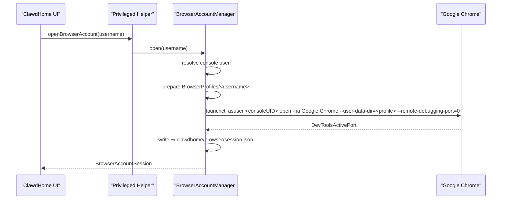
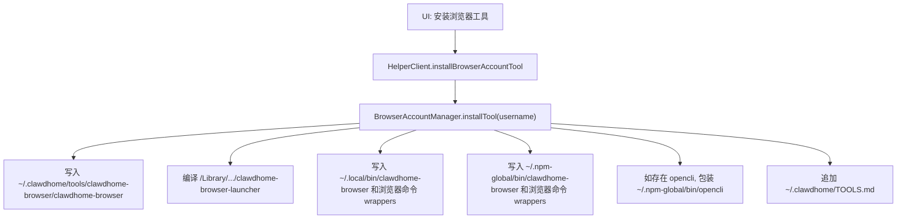
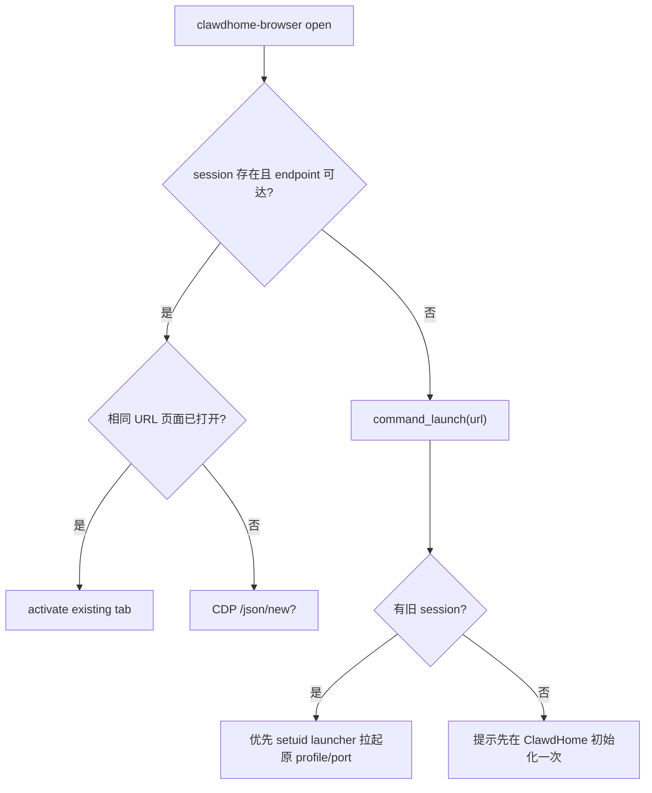

# ClawdHome 用户级浏览器账号技术规格

## 1. 目标

Browser Account 的目标是给每个 macOS 受管用户提供一套独立的、可复用的 Chrome 登录环境。这个能力不绑定 OpenClaw、小龙虾或 Hermes 的运行目录；OpenClaw 和 Hermes 只是消费者，只要该用户 PATH 中能找到 `clawdhome-browser` 或常见浏览器命令 wrapper，就会走同一套用户级浏览器账号。

V1 仍然由 ClawdHome Helper 负责初始化和安装工具。Chrome GUI 进程实际由当前 macOS console 用户启动，因为 macOS 图形应用必须挂在当前桌面会话上；但 profile、session 文件、命令行工具和 wrapper 都按目标用户隔离。

## 2. 核心约束

- 不使用用户主 Chrome profile。
- 每个受管用户有独立 profile，不共享 cookie/session。
- CDP 只绑定 `127.0.0.1`。
- `clawdhome-browser open <url>` 会复用已存在页面，避免反复打开 `https://clawdhome.ai`。
- 工具安装在用户级全局位置：`~/.clawdhome`、`~/.local/bin`、`~/.npm-global/bin`。
- `.openclaw` 只作为旧版本 session/profile 兼容读取和重置清理路径，不再作为新安装路径。

## 3. 关键路径

| 路径 | 归属 | 用途 |
| --- | --- | --- |
| `/Users/<console>/Library/Application Support/ClawdHome/BrowserProfiles/<username>/` | console 用户，`0700` | ClawdHome UI 初始化出来的 Chrome profile |
| `/Users/<username>/.clawdhome/browser/session.json` | 目标用户，`0600` | 当前 CDP endpoint、profile、端口、启动时间 |
| `/Users/<username>/.clawdhome/browser/profile/` | 目标用户 | 用户命令自行启动时的新 profile 默认路径 |
| `/Users/<username>/.clawdhome/browser/debug.log` | 目标用户 | shim、wrapper、launcher 调试日志 |
| `/Users/<username>/.clawdhome/tools/clawdhome-browser/clawdhome-browser` | 目标用户，可执行 | Python CLI 主体 |
| `/Users/<username>/.local/bin/clawdhome-browser` | 目标用户，可执行 | 运行时无关的用户级入口 |
| `/Users/<username>/.npm-global/bin/clawdhome-browser` | 目标用户，可执行 | OpenClaw/npm 环境入口 |
| `/Users/<username>/.local/bin/open` 等 | 目标用户，可执行 | 常见浏览器打开命令 wrapper |
| `/Users/<username>/.npm-global/bin/open` 等 | 目标用户，可执行 | OpenClaw 维护命令里的浏览器命令 wrapper |
| `/Library/Application Support/ClawdHome/BrowserLaunchers/<username>/clawdhome-browser-launcher` | `root:wheel`，`4755` | 从用户命令借助当前 console GUI session 拉起 Chrome |
| `/Users/<username>/.clawdhome/TOOLS.md` | 目标用户 | 用户级工具说明 |

## 4. 组件

| 组件 | 文件 | 职责 |
| --- | --- | --- |
| UI | `ClawdHome/Views/UserDetailView.swift` | 浏览器账号卡片：打开、安装工具、刷新、重置 |
| Auth assist | `ClawdHome/ClawdHomeApp.swift` | 维护窗口授权链接通过用户级浏览器账号打开 |
| XPC Protocol | `Shared/HelperProtocol.swift` | Browser Account XPC 方法 |
| XPC Client | `ClawdHome/Services/HelperClient.swift` | App 侧 async 封装 |
| Helper Surface | `ClawdHomeHelper/HelperImpl+BrowserAccount.swift` | XPC 到 Manager 的薄转发 |
| Manager | `ClawdHomeHelper/Operations/BrowserAccountManager.swift` | Chrome 启动、session 写入、工具安装、wrapper 生成 |
| Models | `Shared/BrowserAccountModels.swift` | 路径常量、session/status 模型、DevToolsActivePort 解析 |

## 5. UI 打开浏览器账号流程

这里的 `username` 是受管 macOS 用户，不是 OpenClaw/Hermes 的运行时类型。Chrome GUI 进程归属于当前 console 用户；登录态隔离依赖独立 `--user-data-dir`。

## 6. 工具安装流程

`.local/bin` 是运行时无关入口，Hermes 和其他用户级工具优先使用它；`.npm-global/bin` 保留给 OpenClaw/npm 生态。OpenCLI wrapper 只处理 npm-global 下的 OpenCLI，因为真实 daemon 路径依赖 npm 包布局。

## 7. 用户命令打开 URL

`open`、`xdg-open`、`sensible-browser`、`google-chrome`、`chrome`、`chromium`、`chromium-browser` 会被 wrapper 接管。传入 http(s) URL 时会执行 `clawdhome-browser open <url>`；无参数时默认打开 `https://clawdhome.ai`。如果该页面已经打开，只激活，不再新增 tab。

## 8. OpenCLI Browser Bridge 预启动

如果用户已经安装 `opencli`，ClawdHome 会把原始入口保存为 `opencli.clawdhome-real`，并生成 wrapper：

1. 先执行 `CLAWDHOME_BROWSER_HIDE=1 clawdhome-browser open https://clawdhome.ai`。
2. 若 OpenCLI daemon 未运行，则启动真实 npm daemon。
3. 等待 Browser Bridge extension 连接。
4. 执行 `opencli.clawdhome-real <原参数>`。

这个链路解决的是“不先打开 Chrome，Browser Bridge extension 不会连上”的问题。它不依赖 OpenClaw 目录，只依赖用户 PATH 中的 browser wrapper 和 `.clawdhome/browser/session.json`。

## 9. 初始化默认安装策略

Browser Account 是 OpenClaw 和 Hermes 的默认前置能力，不再要求用户单独点击“安装浏览器工具”。

OpenClaw 初始化顺序：

1. 修复 Homebrew 权限。
2. 安装 Node.js。
3. 配置 npm 用户目录。
4. 设置 npm registry。
5. 安装 `clawdhome-browser`、浏览器命令 wrappers、OpenCLI wrapper，首次打开一次专属 Chrome 写入 session，然后立即关闭该 profile 的 Chrome。
6. 安装 OpenClaw。
7. 启动 Gateway。

Hermes 初始化顺序：

1. 修复 Homebrew 权限。
2. 安装 Node.js。
3. 安装 `clawdhome-browser`、浏览器命令 wrappers、OpenCLI wrapper，首次打开一次专属 Chrome 写入 session，然后立即关闭该 profile 的 Chrome。
4. 安装 Hermes。
5. 验证安装。
6. 启动 Gateway。

Helper 层也会在 `installOpenclaw` / `reinstallOpenclaw` / `installHermes` 前执行同样的 Browser Account 前置准备，覆盖非 Wizard 入口。预热完成后会写入 `~/.clawdhome/browser/install-warmup.json`；同一用户后续安装流程再次进入时只校验/安装工具，不再重复打开 Chrome。

## 10. Reset

重置会备份并移除：

- UI profile：`/Users/<console>/Library/Application Support/ClawdHome/BrowserProfiles/<username>/`
- 用户命令 profile：`/Users/<username>/.clawdhome/browser/profile/`
- 旧版本兼容 profile：`/Users/<username>/.openclaw/browser-profile/`
- 新 session：`/Users/<username>/.clawdhome/browser/session.json`
- 旧 session：`/Users/<username>/.openclaw/clawdhome-browser-session.json`

profile 使用 `.backup-<yyyyMMdd-HHmmss>` 重命名，不直接删除。

## 11. 安全边界

- CDP 端口随机或复用 session 端口，且只绑定 `127.0.0.1`。
- session 文件权限 `0600`。
- setuid launcher 只读取调用者 home 下的 session，不接受任意 profile 参数。
- 这不是强恶意多用户隔离；本机 root、当前 console 用户、能读目标用户 session 的进程仍可干预。

## 12. 兼容策略

新版本不再把 Browser Account 安装到 `.openclaw`。为避免已有用户立即失效，当前实现仍会：

- 读取旧 session：`~/.openclaw/clawdhome-browser-session.json`，并迁移写入新 session。
- 查找旧 launcher：`~/.openclaw/tools/clawdhome-browser/clawdhome-browser-launcher`。
- reset 时备份旧 profile：`~/.openclaw/browser-profile`。

这些兼容路径只用于迁移和清理，不是新设计的主路径。

## 13. 验证清单

1. 构建 Debug app。
2. 安装 helper。
3. 重启 ClawdHome。
4. 对两个不同受管用户分别打开浏览器账号，确认 profile 路径不同，cookie 不互通。
5. 安装浏览器工具，确认：
   - `~/.clawdhome/tools/clawdhome-browser/clawdhome-browser`
   - `~/.local/bin/clawdhome-browser`
   - `~/.npm-global/bin/clawdhome-browser`
   - `~/.clawdhome/TOOLS.md`
6. 在 OpenClaw 维护窗口执行 OAuth 登录，确认不再打开 Arc/Safari，URL 进入 ClawdHome Chrome。
7. 在 Hermes 用户命令环境执行 `open https://clawdhome.ai`，确认同样走用户级 browser wrapper。
8. 执行 `opencli xiaohongshu search AI`，确认 wrapper 只预打开一次 `https://clawdhome.ai`，Browser Bridge 能连接。
9. 执行 reset，确认该用户登录态清空，其他用户不受影响。
